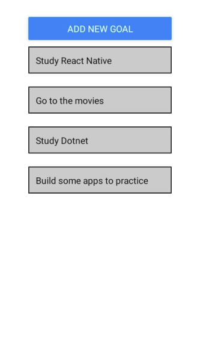
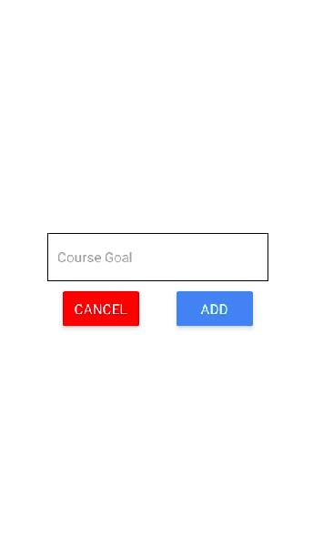

# Goals List - Jose Abel Ramirez Frontany

Goal List, a todo app build for mobile in React Native with expo tool.




## Built With

- expo
- react
- react-dom
- react-native
- react-native-web

## React Native Components

- View
- Text
- StyleSheet
- TextInput
- Modal
- FlatList
- Button
- TouchableOpacity

## Getting Started

To get a local copy up and running follow these simple example steps.

### Setup

Go to the top of the page, press te green button that says "Code", and copy the link. Then you have to go to your console and type

```
    git clone 'repository-link'
```

That's all, you are ready to go!

### Install

Run the following command to have all npm packages dependencies installed:

```
    npm install
```

### Usage

To start the webpack-dev-server, run the following command:

```
    npm start
```

Download Expo Go from the Play Store or App Store and scan the QR code showing on the terminal with the Expo Go app on the phone to see the app on your mobile.

## Author: Jose Abel Ramirez Frontany\*\*

- GitHub: [Jose Abel Ramirez Frontany](https://github.com/jose-Abel)
- Linkedin: [Jose Abel Ramirez Frontany](https://www.linkedin.com/in/jose-abel-r-7674a842/)

## 🤝 Contributing

Contributions, issues, and feature requests are welcome!

## 📝 License

This project is MIT licensed.

## Show your support

Give a ⭐️ if you like this project!
